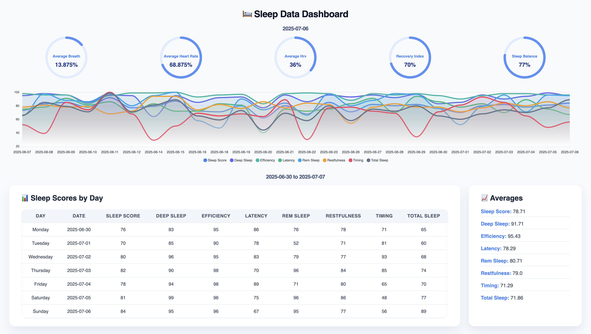

# Sleep Data Dashboard

A simple, interactive dashboard for visualizing health and sleep tracking data derived from the Oura Ring API.

## Oura Data

This project is built to display and analyze health and sleep data from the Oura Ring, including:

- Oura ring metrics
- Health data analytics
- Sleep scores and trends derived from the Oura API

## Getting Started

To get started:

1. **Obtain your Oura API token.**
2. Create a `.env` file in the project root.
3. Add your token to the `.env` file in the following format: token=YOUR_OURA_API_TOKEN
4. Install **uv** (a fast Python package and runtime manager): `curl -LsSf https://astral.sh/uv/install.sh | sh`

## Installation

1. Clone this repo
2. Run  `uv run main.py`
3. Open the `http://0.0.0.0:8000` file in your preferred web browser.
4. The dashboard will load and render sample charts and tables.  

## Notes

- The dashboard is designed to be easily extended with additional metrics or visualizations.
- Notes and annotations can be added within the designated sections of the interface.
- Future improvements could include:
  - Data persistence via localStorage or database
  - User authentication and session management
  - Historical data exports